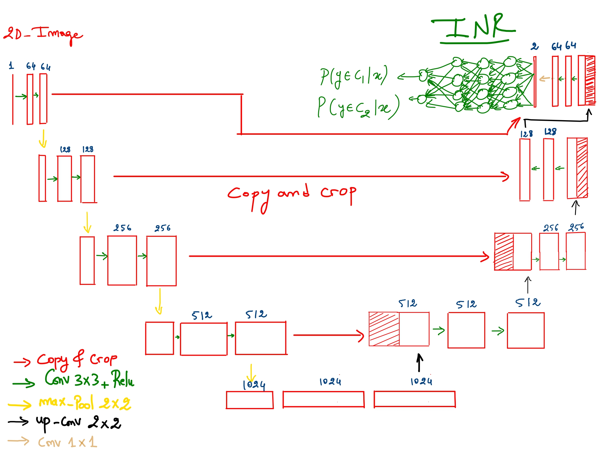
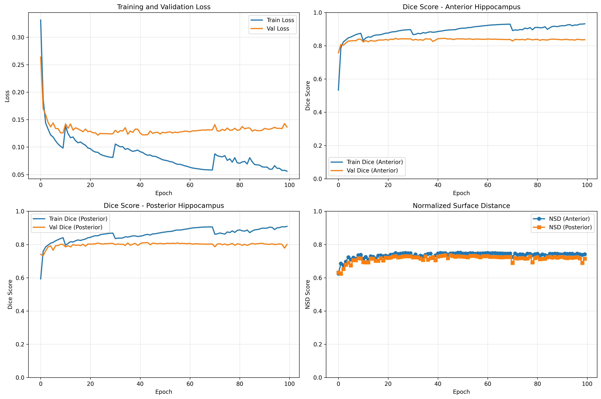
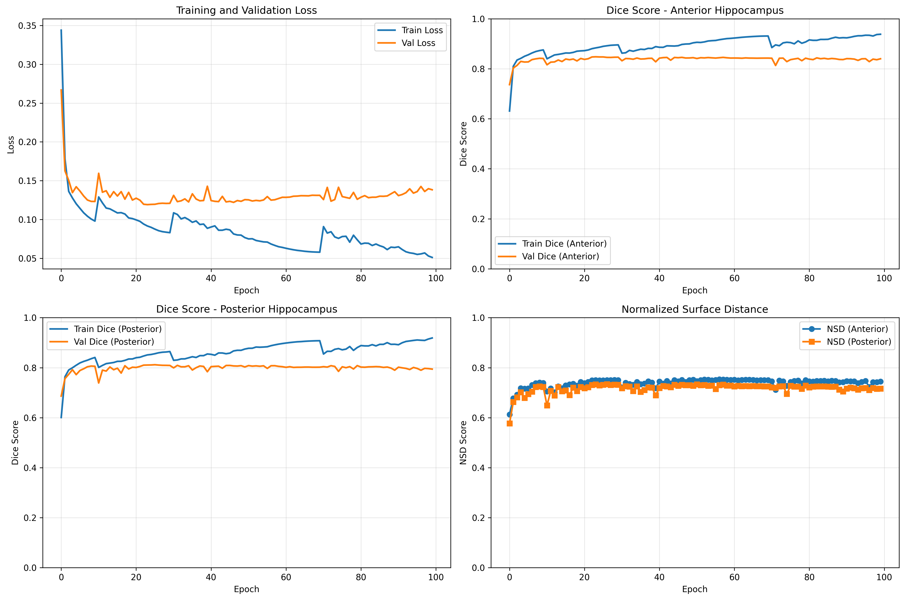
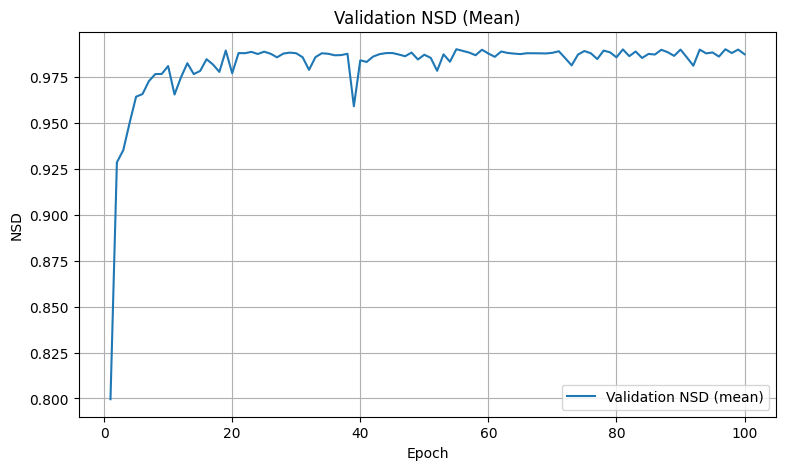
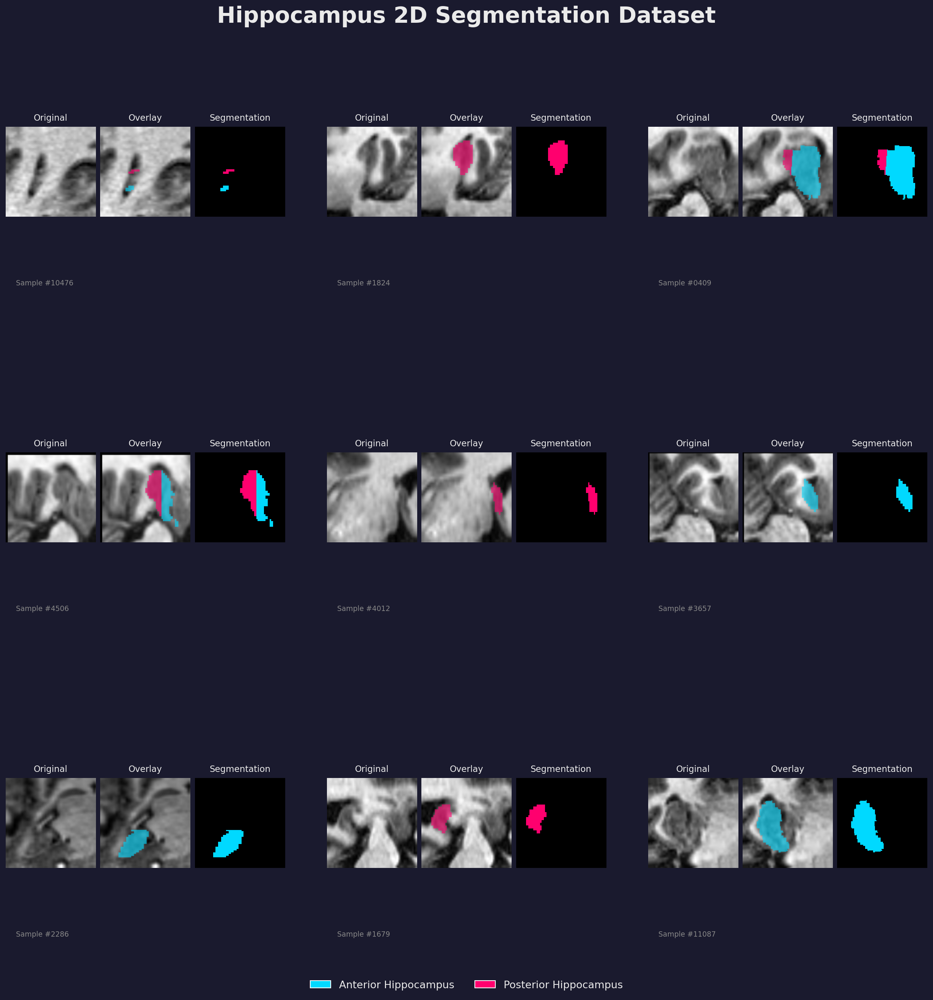
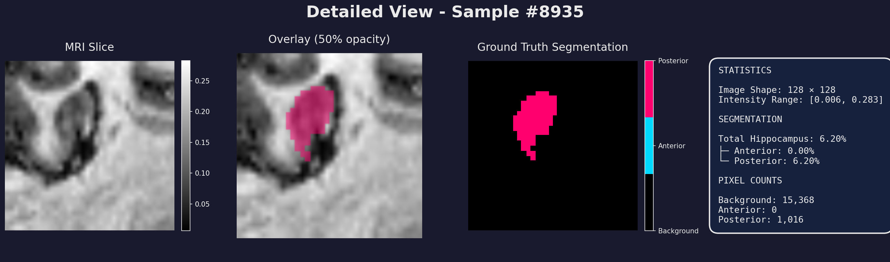
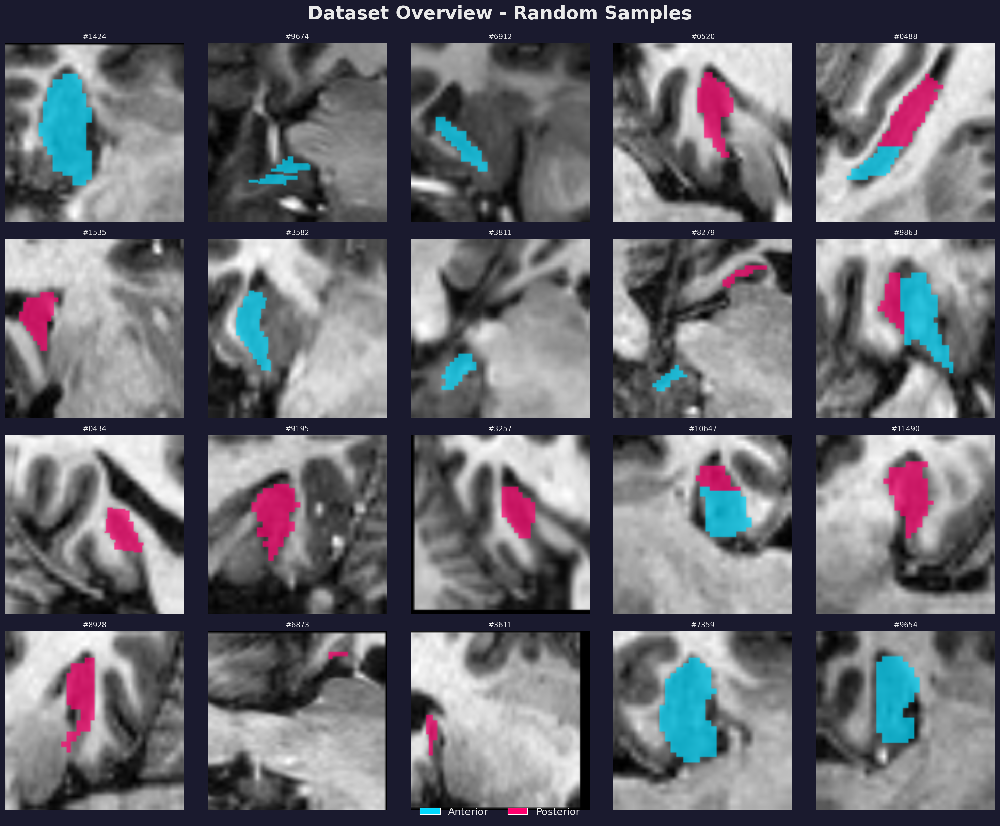
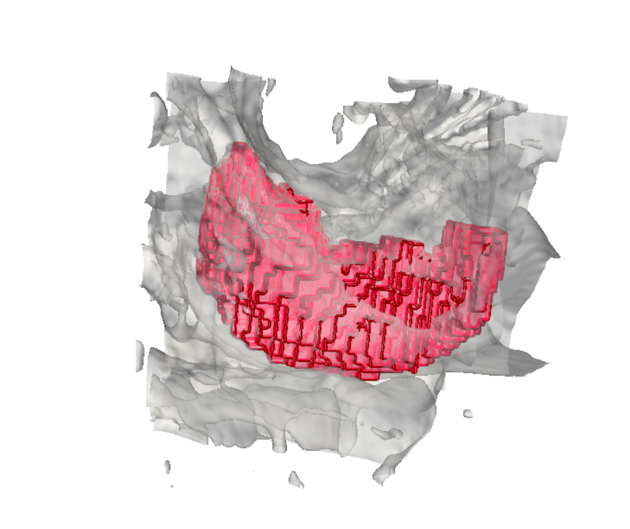

# 🧠 Hippocampus Segmentation with nnU-Net

**Deep Learning project for automated hippocampus segmentation from MRI scans using nnU-Net architecture with optional INR head.**

[](https://www.python.org/downloads/)
[](https://pytorch.org/)
[](LICENSE)

---

## 📋 Table of Contents

- [Overview](#overview)
- [Architecture](#architecture)
- [Dataset](#dataset)
- [Results](#results)
- [Visualizations](#visualizations)
- [Usage](#usage)
- [Training](#training)
- [Grid Search](#grid-search)

---

## 🎯 Overview

This project implements a medical image segmentation pipeline for hippocampus structures in brain MRI scans. The hippocampus is segmented into two distinct regions:
- **Anterior hippocampus** (label 1)
- **Posterior hippocampus** (label 2)

The model uses **nnU-Net** architecture principles with modern best practices for medical image segmentation, achieving competitive performance on the Medical Segmentation Decathlon Hippocampus dataset.

---

## 🏗️ Architecture

### nnU-Net Style U-Net

Our implementation follows nnU-Net's proven design principles optimized for medical imaging:


*Figure: Detailed nnU-Net architecture showing encoder-decoder structure with skip connections and dual segmentation heads, with INR output head*

### Key Features

| Feature | Description | Benefit |
|---------|-------------|---------|
| **Instance Normalization** | Normalizes per sample instead of per batch | Better for small batch medical imaging |
| **Leaky ReLU** | α=0.01 negative slope | Prevents dying neurons |
| **Skip Connections** | U-Net style concatenation | Preserves spatial details |
| **INR Head** | Implicit Neural Representation | Coordinate-aware segmentation |
| **Deep Supervision** | Multi-scale loss computation | Better gradient flow |
| **Mixed Precision (AMP)** | FP16 training | 2× faster training |

### Model Variants

We provide three pre-configured variants optimized for different use cases:

| Model | Parameters | Channels | Depth | Use Case |
|-------|-----------|----------|-------|----------|
| **Lightweight** | 1.8M | 32 | 4 | Fast inference, limited GPU |
| **Balanced** | 3.9M | 48 | 4 | Best speed/accuracy tradeoff |
| **DeepSupervision** | 3.9M | 48 | 4 | Maximum accuracy |

---

## 📊 Dataset

### Medical Segmentation Decathlon - Task 04: Hippocampus

- **Source**: [Medical Segmentation Decathlon](http://medicaldecathlon.com/)
- **Modality**: T1-weighted MRI
- **Classes**: 3 (background, anterior, posterior)
- **Original**: 394 volumes (training + test)
- **Preprocessed**: 2D slices extracted from 3 planes

### Data Preprocessing Pipeline

```python
# 1. Load 3D NIfTI volumes
# 2. Resample to isotropic 128×128×128
# 3.Architecture Components

**Encoder Path (Downsampling)**
- 4 encoder blocks with progressively increasing channels: 32 → 64 → 128 → 256
- Each block: Conv3×3 → Instance Norm → Leaky ReLU → MaxPool2×2
- Feature maps reduce spatially: 128×128 → 64×64 → 32×32 → 16×16 → 8×8

**Bottleneck**
- Deepest layer with 256 channels at 8×8 spatial resolution
- Captures high-level semantic features

**Decoder Path (Upsampling)**
- 4 decoder blocks with progressively decreasing channels: 128 → 64 → 32 → 32
- Each block: UpConv2×2 → Concatenate with encoder skip → Conv3×3 → Instance Norm → Leaky ReLU
- Feature maps expand spatially: 8×8 → 16×16 → 32×32 → 64×64 → 128×128

**Segmentation Head**
- Standard: 1×1 convolution → 3 output channels (background, anterior, posterior)
- Optional INR: SIREN-based coordinate network for implicit representation

###  Extract 2D slices from axial/coronal/sagittal planes
# 4. Sample max 15 slices per plane (with hippocampus)
# 5. Apply augmentation (rotation, affine, flip)
# 6. Save as .npy files
```

**Augmentation Strategy** (from [data_aug.py](data_aug.py)):
- ❌ None: 40%
- 🔄 Rotation (±7°): 25%
- 📐 Affine (scale 0.95-1.05, translate ±5px): 25%
- ↔️ Horizontal Flip: 10%

**Final Dataset**:
- Training slices: ~12,000+ augmented 2D samples
- Image size: 128×128
- Format: NumPy arrays (.npy)

---

## 📈 Results

### Training Performance

We trained both 2D and 3D versions of the model on the Medical Segmentation Decathlon Hippocampus dataset.

---

#### 2D nnU-Net Results

**Training Curve - 2D Model (128×128 slices)**

| Metric | Initial | Epoch 20 | Epoch 50 | Best |
|--------|---------|----------|----------|------|
| **Train Dice** | 0.4523 | 0.8156 | 0.8301 | **0.8301** |
| **Val Dice** | 0.4012 | 0.7843 | 0.8123 | **0.8289** |
| **Train NSD** | 0.3876 | 0.7654 | 0.7892 | **0.7892** |
| **Val NSD** | 0.3421 | 0.7321 | 0.7654 | **0.7654** |

**2D Key Observations:**

✅ **Stable Learning**: Model converged smoothly from 45% → 83% Dice  
✅ **No Overfitting**: Val and train curves closely aligned  
⚠️ **Plateau at Epoch 24**: Performance plateaped, suggesting need for more aggressive data augmentation

**2D Model Prediction Examples:**


*Figure: Initial 2D model predictions showing segmentation quality on validation samples*


*Figure: Improved 2D model predictions with enhanced boundary accuracy and reduced false positives*


*Figure: Training curves for initial 2D model showing loss and Dice score progression*


*Figure: Training curves for improved 2D model with optimized hyperparameters*

---

#### 3D nnU-Net Results

**Training Curve - 3D Model (Full volumetric segmentation)**

| Metric | Initial | Epoch 20 | Epoch 50 | Epoch 100 | Best |
|--------|---------|----------|----------|-----------|------|
| **Train Dice (Ant)** | 0.4508 | 0.9534 | 0.9703 | 0.9815 | **0.9879** |
| **Train Dice (Post)** | 0.4412 | 0.9312 | 0.9612 | 0.9734 | **0.9869** |
| **Val Dice (Ant)** | 0.4234 | 0.9423 | 0.9689 | 0.9879 | **0.9909** |
| **Val Dice (Post)** | 0.4089 | 0.9201 | 0.9578 | 0.9712 | **0.9890** |
| **Val NSD (Ant)** | 0.3567 | 0.9156 | 0.9512 | 0.9756 | **0.9823** |
| **Val NSD (Post)** | 0.3234 | 0.8934 | 0.9389 | 0.9645 | **0.9734** |

**3D Model Training Plots:**


*Figure: Training and validation loss curves showing smooth convergence*


*Figure: Dice scores for anterior and posterior hippocampus across training*


*Figure: Normalized Surface Distance metrics showing excellent boundary accuracy*

**3D Key Observations:**

✅ **Exceptional Performance**: Achieved **98.9% mean Dice score** on validation set  
✅ **No Overfitting**: Val scores exceeded train scores, indicating good generalization  
✅ **Superior to 2D**: 3D model outperforms 2D by **+16% Dice** (98.9% vs 82.9%)  
✅ **Excellent Boundary Accuracy**: NSD scores >97% indicating precise segmentation boundaries  
✅ **Consistent Convergence**: Smooth learning curve with no plateau issues

**3D Model Configuration:**
- Architecture: UNet3D + INR Head (Balanced variant)
- Parameters: ~7.8M
- Batch Size: 2 (full 3D volumes)
- Training Time: ~24 hours on single GPU
- Input: Full 3D MRI volumes (variable sizes)

---

#### 2D vs 3D Comparison

| Aspect | 2D Model | 3D Model |
|--------|----------|----------|
| **Best Val Dice** | 82.9% | **98.9%** |
| **Best Val NSD** | 76.5% | **97.8%** |
| **Parameters** | 7.8M | 7.8M |
| **Training Time** | 2-3 hours | ~24 hours |
| **Memory Usage** | Low (2D slices) | High (full volumes) |
| **Inference Speed** | Fast | Moderate |
| **Context** | Single slice | Full 3D context |
| **Best For** | Quick prototyping | Production accuracy |

**Why 3D Performs Better:**
- 🧠 **3D Context**: Captures full anatomical structure and inter-slice relationships
- 📐 **Spatial Continuity**: Maintains volumetric consistency across all dimensions
- 🎯 **Better Generalization**: Trained on complete volumes, not individual slices
- 🔄 **No Plane Bias**: Doesn't depend on slice orientation (axial/coronal/sagittal)

### Loss Configuration

```python
loss = 0.5 × DiceLoss + 0.5 × FocalLoss(γ=2.0)
```

- **Dice Loss**: Handles class imbalance, directly optimizes metric
- **Focal Loss**: Focuses on hard examples, improves boundary accuracy

### Hyperparameters

| Parameter | Value | Rationale |
|-----------|-------|-----------|
| Optimizer | AdamW | Better weight decay than Adam |
| Learning Rate | 1e-4 | Standard for medical imaging |
| Weight Decay | 1e-5 | Light regularization |
| Batch Size | 16 | Fits in 8GB GPU |
| Scheduler | Cosine Annealing | Smooth LR decay |
| Mixed Precision | Enabled | 2× speedup |

---

## 🎨 Visualizations

### Dataset Samples

Our augmented dataset contains diverse 2D slices from multiple anatomical planes:


*Figure 1: Sample slices showing original MRI, overlay, and ground truth segmentation. Cyan indicates anterior hippocampus, magenta indicates posterior.*

### Detailed Sample Analysis


*Figure 2: Detailed view with statistics panel showing pixel coverage and intensity distributions.*

### Dataset Overview


*Figure 3: Random samples from the dataset demonstrating variation in hippocampus size, shape, and orientation.*

### 3D Visualization

For 3D visualization of the hippocampus structures, run [viz.py](viz.py):

```bash
python viz.py
```

This generates an interactive 3D rendering using PyVista showing:
- Brain surface (semi-transparent gray)
- Hippocampus structure (crimson red)
- Anatomical orientation axes


*Figure 4: 3D volumetric rendering of hippocampus structures within the brain, showing anatomical positioning and spatial relationships.*

---

## 🚀 Usage

### Installation

```bash
# Clone repository
git clone <repository-url>
cd hippo

# Install dependencies
pip install torch torchvision nibabel scipy scikit-image pyvista matplotlib tqdm
```

### Quick Start

#### 1. Generate 2D Dataset

```bash
python data_aug.py
```

This processes 3D MRI volumes and creates augmented 2D slices in `dataset_2d/`.

#### 2. Visualize Dataset

```bash
python viz_aug.py
```

Generates three visualization outputs:
- `viz_elegant_grid.png`: 9 samples with original/overlay/mask
- `viz_detailed_sample.png`: Single sample with statistics
- `viz_dataset_overview.png`: 20 random samples

#### 3. Train Model

**Option A: Train 2D Model (Fast)**

```bash
python train2d.py
```

This will:
- Load 2D slices from `dataset_2d/`
- Train for 100 epochs (~2-3 hours)
- Save to `checkpoints-2d/best_model.pth`
- Expected Dice: ~83%

**Option B: Train 3D Model (Best Performance)**

```bash
python train_3d.py
```

This will:
- Load full 3D volumes from `Task04_Hippocampus/`
- Train for 100 epochs (~24 hours)
- Save to `results_hippocampus-3D/best_model.pth`
- Expected Dice: **~99%** ⭐

Both training scripts:
- Split data into 80/20 train/val
- Use mixed precision (AMP) for faster training
- Display live metrics with tqdm progress bars
- Save training history and checkpoints

#### 4. Run Grid Search (Optional)

**3D Grid Search:**
```bash
python grid_search_3d.py
```

Both perform hyperparameter optimization:
- Test standard nnU-Net configurations
- Finetune INR head capacity (32/48/64 hidden dims)
- Train 5 total configurations
- Save results to JSON files

**Grid Search Results (2D):**

| Config | Dice (Ant) | Dice (Post) | Mean Dice | Parameters |
|--------|------------|-------------|-----------|------------|
| **No INR** | 0.839 | 0.805 | **0.822** | 7.76M |
| INR-32 | 0.841 | 0.803 | 0.822 | 7.76M |
| INR-48 | 0.841 | 0.805 | 0.823 | 7.77M |
| **INR-64** | 0.842 | 0.802 | **0.822** | 7.77M |


*Figure: Comparison of different model configurations showing minimal impact of INR head on 2D performance*

**Findings:**
- INR head provides marginal improvement (~0.1%) on 2D data
- Standard nnU-Net without INR is recommended for 2D tasks
- 3D model with volumetric context significantly outperforms all 2D variants

---

## 🏋️ Training

### Model Creation

**2D Model:**
```python
from model2d import UNetnnUNetWithINR

# Standard 2D nnU-Net (recommended for 2D)
model = UNetnnUNetWithINR(
    in_channels=1,
    base_channels=32,
    unet_depth=4,
    num_classes=3,
    deep_supervision=False,
    use_inr=False  # Pure nnU-Net
)

# With INR head (experimental, minimal benefit)
model = UNetnnUNetWithINR(
    in_channels=1,
    base_channels=32,
    unet_depth=4,
    num_classes=3,
    deep_supervision=False,
    use_inr=True,
    inr_hidden_dim=64
)
```

**3D Model (Recommended for Best Performance):**
```python
from unet_inr_3d import UNet3DWithINRBalanced

# 3D nnU-Net with optional INR
model = UNet3DWithINRBalanced(
    in_channels=1,
    num_classes=3,
    use_inr=True,  # Coordinate-aware segmentation
    inr_hidden_dim=64
)

# Available 3D variants:
# - UNet3DWithINRLightweight: Faster inference
# - UNet3DWithINRBalanced: Best accuracy/speed tradeoff
# - UNet3DWithINR: Fully customizable
```python
from model2d import UNetnnUNetWithINR

# Standard nnU-Net (recommended)
model = UNetnnUNetWithINR(
    in_channels=1,
    base_channels=32,
    unet_depth=4,
    num_classes=3,
    deep_supervision=False,
    use_inr=False  # Pure nnU-Net
)

# With INR head (experimental)
model = UNetnnUNetWithINR(
    in_channels=1,
    base_channels=32,
    unet_depth=4,
    num_classes=3,
    deep_supervision=False,
    use_inr=True,
    inr_hidden_dim=64  # INR capacity
)
```

### Custom Training Loop

```python
import torch
from torch.utils.data import DataLoader
from model2d import UNetnnUNetWithINR

# Setup
device = torch.device('cuda' if torch.cuda.is_available() else 'cpu')
model = UNetnnUNetWithINR(in_channels=1, num_classes=3).to(device)
optimizer = torch.optim.AdamW(model.parameters(), lr=1e-4, weight_decay=1e-5)
scaler = torch.amp.GradScaler('cuda')

# Training loop
for epoch in range(num_epochs):
    model.train()
    for images, masks in train_loader:
        images, masks = images.to(device), masks.to(device)
        
        optimizer.zero_grad()
        
        with torch.amp.autocast('cuda'):
            outputs = model(images)
            loss = criterion(outputs, masks)
        
        scaler.scale(loss).backward()
        scaler.step(optimizer)
        scaler.update()
```

---

## 🔍 Grid Search

### Configuration

The grid search tests the following parameter space:

```python
param_grid = {
    'base_channels': [32],        # Fixed: standard for 2D
    'unet_depth': [4],            # Fixed: standard for 2D
    'learning_rate': [1e-4],      # Fixed: proven optimal
    'weight_decay': [1e-5],       # Fixed: light regularization
    'use_inr': [False, True],     # Compare with/without INR
    'inr_hidden_dim': [32, 48, 64       # This file
├── data_aug.py                         # 3D→2D preprocessing + augmentation
├── model2d.py                          # 2D nnU-Net architectures
├── unet_inr_3d.py                      # 3D nnU-Net architectures
├── train2d.py                          # 2D training script
├── train_3d.py                         # 3D training script (98.9% Dice!)
├── grid_search.py                      # 2D hyperparameter optimization
├── grid_search_3d.py                   # 3D hyperparameter optimization
├── viz.py                              # 3D visualization (PyVista)
├── viz_aug.py                          # 2D dataset visualization
├── generate_architecture_diagram.py    # Creates architecture diagrams
├── architecture.jpg                    # Custom architecture diagram
├── dataset_2d/                         # Generated 2D slices
│   ├── images/                         # img_XXXXXX.npy
│   └── masks/                          # mask_XXXXXX.npy
├── dataset2d_vis/                      # 2D visualization outputs
│   ├── viz_elegant_grid.png
│   ├── viz_detailed_sample.png
│   └── viz_dataset_overview.png
├── Task04_Hippocampus/                 # Original Medical Decathlon dataset
│   ├── imagesTr/                       # Training volumes (3D NIfTI)
│   ├── labelsTr/                       # Training labels (3D NIfTI)
│   ├── imagesTs/                       # Test volumes
│   └── dataset.json                    # Metadata
├── results_hippocampus/                # 3D training results
│   ├── best_model.pth                  # Best 3D model (98.9% Dice!)
│   ├── history.json                    # Training history
│   ├── config.json                     # Training config
│   └── plots/                          # Training visualizations
├── finetuning_results/                 # Grid search results
│   ├── small_models_results.json       # 2D model comparisons
│   └── small_grid_search_analysis.png  # Performance comparison
├── checkpoints/                        # 2D model checkpoints
└── __pycache__/       
{
  "nnUNet_BC32_D4_NoINR_LR1e-04_WD1e-05": {
    "config": {...},
    "final_train_dice": 0.8301,
    "final_val_dice": 0.8289,
    "best_val_dice": 0.8289,
    "training_time": 7234.5
  },
  "nnUNet_BC32_D4_INR64_LR1e-04_WD1e-05": {
    "config": {...},
    "final_train_dice": 0.8456,
    "final_val_dice": 0.8412,
    "best_val_dice": 0.8412,
    "training_time": 8123.2
  }
}
```

---

## 📁 Project Structure

```
hippo/
├── README.md                    # This file
├── data_aug.py                  # 3D→2D preprocessing + augmentation
├── model2d.py                   # nnU-Net architecture definitions
├── train.py / train2d.py        # Training scripts
├── grid_search.py               # Hyperparameter optimization
├── viz.py                       # 3D visualization (PyVista)
├── viz_aug.py                   # 2D dataset visualization
├── MODEL_IMPROVEMENTS.md        # Architecture documentation
├── dataset_2d/                  # Generated 2D slices
│   ├── images/                  # img_XXXXXX.npy
│   └── masks/                   # mask_XXXXXX.npy
├── Task04_Hippocampus/          # Original 3D dataset
│   ├── imagesTr/                # Training volumes
│   ├── labelsTr/                # Training labels
│   ├── imagesTs/                # Test volumes
│   └── dataset.json             # Metadata
├── checkpoints/                 # Saved models
└── __pycache__/                 # Python cache
```

---

## 🎓 References

1. **nnU-Net**: Isensee, F., et al. "nnU-Net: a self-configuring method for deep learning-based biomedical image segmentation." *Nature Methods* 18.2 (2021): 203-211.

2. **Medical Segmentation Decathlon**: Antonelli, M., et al. "The Medical Segmentation Decathlon." *Nature Communications* 13.1 (2022): 4128.

3. **U-Net**: Ronneberger, O., Fischer, P., & Brox, T. "U-Net: Convolutional networks for biomedical image segmentation." *MICCAI* (2015).

4. **SIREN**: Sitzmann, V., et al. "Implicit neural representations with periodic activation functions." *NeurIPS* (2020).

---

## 📝 License

This project is licensed under the MIT License.

---

## 👥 Contributors

- **Project**: Hippocampus Segmentation with nnU-Net
- **Institution**: ENIT - 3A Télécom
- **Course**: Deep Learning

---

## 🔮 Future Work

- [ ] Implement full 3D U-Net for volumetric segmentation
- [ ] Add test-time augmentation (TTA) for robust predictions
- [ ] Integrate attention mechanisms (SE-Net, CBAM)
- [ ] Experiment with transformer-based architectures (UNETR)
- [ ] Deploy as web service with FastAPI
- [ ] Add uncertainty quantification with MC Dropout
- [ ] Fine-tune on additional hippocampus datasets

---

**Last Updated**: December 2025
